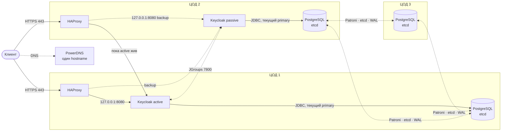
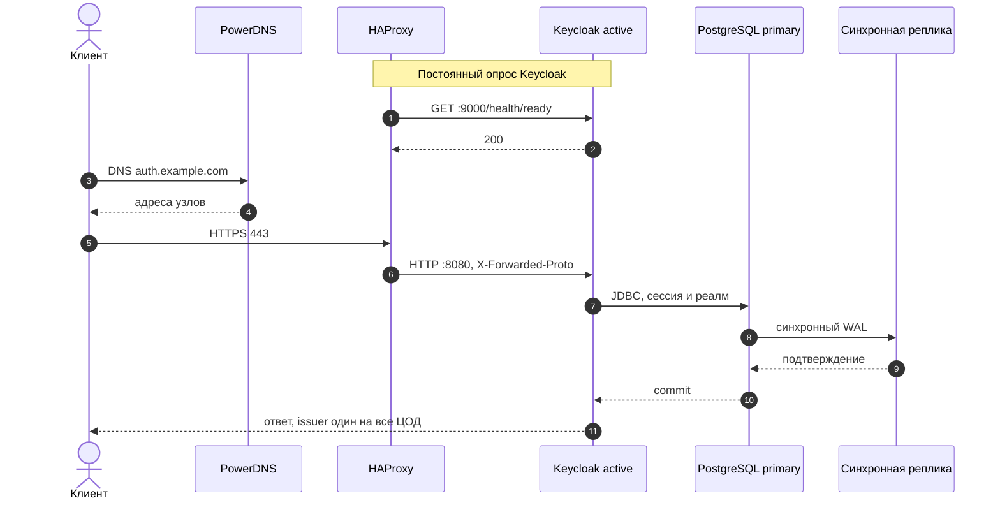

# Keycloak на трёх ЦОД

Ansible-проект ставит и обновляет Keycloak 26.8 в схеме **active-passive**: два узла, на каждом Keycloak и HAProxy, и общая синхронно реплицируемая PostgreSQL на трёх ЦОД. Активный узел принимает весь вход. Пассивный запущен, состоит с ним в одном кластере и получает трафик, только когда активный не проходит проверку здоровья.

Внешний Infinispan не используется. Сессии пользователей Keycloak 26 хранит в PostgreSQL, поэтому переключение на пассивный узел не разлогинивает пользователей.

## Что должно быть у сети

- Три площадки с задержкой коммита в PostgreSQL **меньше 10 мс** (ориентир — меньше 5 мс). Это ограничение Keycloak, а не плейбука: каждый логин ждёт синхронную реплику. Та же задержка нужна между двумя узлами Keycloak: они один JGroups-кластер.
- NTP на узлах Keycloak.
- Ровно два узла Keycloak. В группе `keycloak` сначала `keycloak_role: active`, затем `passive`.
- Один hostname, например `auth.example.com`, в PowerDNS. Issuer OIDC должен быть одинаковым. Записи плейбук не создаёт.
- Приватная сеть между узлами БД и между двумя узлами Keycloak: HAProxy ходит на соседний узел, JGroups связывает кластер.

## Схема

Один кластер Keycloak из двух узлов, по одному в ЦОД 1 и ЦОД 2. Имя кластера одно (`keycloak`), узлы находят друг друга через JDBC_PING. HAProxy стоит на том же узле и локальный Keycloak берёт с `127.0.0.1`. ЦОД 3 — только PostgreSQL и etcd. Primary базы Patroni выбирает на любом из трёх узлов; коммит ждёт одну синхронную реплику. Каждый HAProxy шлёт запросы активному Keycloak, пассивный помечен `backup`.



Вход пользователя. Проверка здоровья Keycloak идёт постоянно, не внутри этого запроса. Коммит в базу не возвращается, пока синхронная реплика не подтвердит WAL.



- HAProxy на узле проверяет локальный Keycloak по `https://127.0.0.1:9000/health/ready`, соседний — по его адресу. Пока активный отвечает 200, пассивный трафик не получает. После трёх неудачных проверок HAProxy переключает запросы на пассивный.
- `http://<узел>:80/lb-check` отвечает 200, если с этого HAProxy доступен хотя бы один Keycloak, и 503, если нет. Тот же ответ есть на 443. Это проверка для того, что стоит перед узлами. Плейбук это «перед» не ставит.
- Группа `gslb` в inventory пустая. Имя клиентов обслуживает PowerDNS.
- JDBC URL перечисляет все узлы Patroni с `targetServerType=primary`. Пишут оба узла Keycloak в один primary.

Потеря ЦОД с активным Keycloak: HAProxy на пассивном узле уводит вход на локальный Keycloak. Потеря узла PostgreSQL: живы два узла etcd, Patroni поднимает primary на синхронной реплике. `synchronous_mode_strict: true` и `synchronous_node_count: 1` — коммит ждёт одну синхронную реплику. При потере двух ЦОД запись останавливается. Если недоступны оба ЦОД с Keycloak, вход не работает, даже когда PostgreSQL в третьем ЦОД ещё жив.

Если сеть режет только путь к активному узлу, HAProxy пассивного узла начнёт слать своих пользователей локально, пока активный ещё обслуживает тех, кто пришёл на него напрямую. Оба процесса тогда пишут в одну базу.

## Подготовка

ОС узлов: Ubuntu 26.04 LTS. Управляющая машина: ansible-core 2.16+.
PostgreSQL 18, Patroni 4.1 и HAProxy 3.2 ставятся из архива Ubuntu; для Patroni плейбук включает компонент `universe`. JDK для Keycloak — Temurin 25, не пакет дистрибутива.

```bash
cp inventories/prod/vault.yml.example inventories/prod/group_vars/all/vault.yml
ansible-vault encrypt inventories/prod/group_vars/all/vault.yml
```

Дальше поправьте `inventories/prod/hosts.yml` (адреса, `ansible_user`) и `inventories/prod/group_vars/all/main.yml` (`keycloak_hostname`, пароли уже берутся из vault).

Внутренний Keycloak берёт сертификат из файлов. Лаборатория без них — `keycloak_allow_self_signed: true`.

```yaml
keycloak_tls_cert_src: /path/on/controller/fullchain.pem
keycloak_tls_key_src: /path/on/controller/privkey.pem
```

Внешний Keycloak (`keycloak_external: true`) выпускает Let's Encrypt на активном узле. Проверка приходит на порт 80 этого узла, HAProxy отдаёт её локальному certbot. Готовый сертификат активный узел копирует на пассивный по SSH (порт 22, пользователь из `ansible_user`) и повторяет это при продлении, каждый день в 03:15. На время выпуска имя должно указывать на активный узел: запрос Let's Encrypt не должен попасть на пассивный. PowerDNS плейбук не настраивает.

```yaml
keycloak_external: true
keycloak_acme_email: admin@example.com
```

Каталог `.pki/` — CA etcd, создаётся на управляющей машине при первом прогоне. Его не коммитят.

## Запуск

```bash
ansible-playbook playbooks/site.yml --ask-vault-pass
ansible-playbook playbooks/status.yml --ask-vault-pass
```

`site.yml` ставит chrony, etcd, Patroni, HAProxy, Keycloak и импортирует реалмы. Повторный запуск не меняет версию: если в переменных другая версия, установка останавливается и просит `update.yml`.

Только конфигурация, по одному узлу:

```bash
ansible-playbook playbooks/configure.yml --ask-vault-pass
```

Внешняя база (Aurora, RDS или уже готовый PostgreSQL). Базу и пользователя плейбук не создаёт: пользователь `keycloak_db_user` должен владеть базой `keycloak_db_name`, пароль — `vault_keycloak_db_password`. В `hosts.yml` поставьте `deploy_database: false` и уберите дочерние группы у `postgres`, иначе Ansible пойдёт на эти узлы.

```yaml
keycloak_db_hosts:
  - keycloak.cluster.example
keycloak_db_tls_mode: verify-full
keycloak_db_ca_file: /path/on/controller/db-ca.pem
```

Несколько адресов означают выбор текущего primary (`targetServerType=primary`). Один адрес подключается напрямую. `verify-ca` и `verify-full` требуют файл CA. Имя в сертификате должно совпадать с адресом из списка. Полный JDBC вместо списка — `keycloak_db_url`; вместе со списком его задавать нельзя.

## Реалмы

Файлы `realms/*.yml` — тот же документ, что у Admin API, только в YAML. Полный экспорт записывается списком `realms:`. Примеры: `realms/apps.yml.example`, `realms/gitlab.yml.example`, `realms/kubernetes.yml.example`. Плейбук сам переводит YAML в JSON запроса.

```bash
cp realms/gitlab.yml.example realms/gitlab.yml
cp realms/kubernetes.yml.example realms/kubernetes.yml
ansible-playbook playbooks/realms.yml --ask-vault-pass
```

GitLab и Kubernetes — отдельные внутренние реалмы с темой `internal-nemero`. Учётные записи между ними не общие. Issuer GitLab: `https://<keycloak_hostname>/realms/gitlab`, клиент `gitlab`. Issuer Kubernetes: `https://<keycloak_hostname>/realms/kubernetes`, публичный клиент `kubernetes`. Группы попадают в claim `groups`. Перед импортом замените адрес GitLab и `secret`.

- Нет реалма — создаётся целиком.
- Реалм уже есть — обновляются его настройки, клиенты, роли, группы и identity providers (`ifResourceExists=OVERWRITE`).
- Пользователи из файла применяются только с `-e keycloak_realm_import_users=true`.
- Удаление: `-e '{"keycloak_realms_absent":["apps"]}'`.
- Секреты клиентов при OVERWRITE перезаписываются. Не храните боевые секреты в git.

Провайдеры — `providers/*.jar`. Темы логина лежат в `themes/<name>/` и попадают в список Login theme реалма.

- `external-nemero` — External NEMERO SSO, внешний вход: фиолетовая сетка и кольца, тёмная карточка.
- `internal-nemero` — Internal NEMERO SSO, вход сотрудников: синяя сетка и контуры, тёмная карточка.

В файле реалма поле `loginTheme`: `external-nemero` или `internal-nemero`. Смена темы перезапускает Keycloak.

## Обновление

Патч (26.8.0 → 26.8.1). Сначала активный узел, затем пассивный. На время обновления активного HAProxy ставит его в `maint`, и трафик уходит на пассивный:

```bash
ansible-playbook playbooks/update.yml -e keycloak_version=26.8.1 --ask-vault-pass
```

Minor и major (26.8 → 26.9 или 27): пассивный узел останавливается, активный обновляется и проверяется, затем обновляется пассивный. Разные minor одновременно не поддерживаются.

Узел можно вывести из проверки, не останавливая Keycloak. `/lb-check` отвечает 503:

```bash
ansible-playbook playbooks/loadbalancer.yml -e '{"haproxy_maintenance_sites":["dc2"]}' --ask-vault-pass
```

Обратно — тот же плейбук без extra-var.

Откат **только патча** внутри того же minor, на один шаг, каталог предыдущего релиза должен остаться на диске:

```bash
ansible-playbook playbooks/rollback.yml --ask-vault-pass
```

Откат minor после миграции схемы не выполняется.

## Порты

| Кто | Куда | Порт |
| --- | --- | --- |
| клиенты | HAProxy на узле Keycloak | 443 |
| проверка снаружи | HAProxy, `GET /lb-check` | 80 |
| HAProxy | свой Keycloak | 127.0.0.1:8080 и :9000 |
| HAProxy | Keycloak соседнего узла | 8080 и 9000 |
| HAProxy passive | CrowdSec Local API на активном узле | 8088 |
| Keycloak active | Keycloak passive | 7800, 57800 |
| Keycloak | PostgreSQL | 5432 |
| Patroni | Patroni REST | 8008 |
| etcd | клиенты / пиры | 2379 / 2380 |

Порты 7800 и 57800 нужны только между двумя узлами Keycloak. Management 9000 снаружи не публикуется. ufw открывает 8080 и 9000 только адресу соседнего узла.

## Внешний SSO

На узлах снаружи открыты только 80 и 443: 80 уходит на HTTPS, кроме `/lb-check`. Остальное режет ufw. Смена списков адресов не удаляет уже добавленные правила: лишние уберите через `ufw status numbered`.

- Внешний Keycloak (`keycloak_external: true`) получает сертификат Let's Encrypt на активном узле, копия лежит на пассивном. Иначе сертификат задаётся файлами. Лаборатория — `keycloak_allow_self_signed: true`.
- TLS 1.2+ и современные шифры.
- Клиентские `X-Forwarded-*` стираются. HAProxy подставляет свои, иначе можно подделать схему и обойти hostname.
- `/admin` и `/realms/master` с интернета отвечают 403, пока `keycloak_admin_cidrs` пуст. Сети администраторов, например `10.20.0.0/24`, перечисляются в этой переменной. Импорт реалмов идёт на `127.0.0.1` узла и этот запрет не задевает.
- С одного IP не больше `keycloak_http_rate_limit` запросов за 10 секунд (по умолчанию 200). Login и token — отдельно, `keycloak_login_rate_limit` (по умолчанию 60). `/lb-check` в лимит не входит.
- CrowdSec читает журнал HAProxy. Сценарии коллекции `crowdsecurity/haproxy` ставят бан, и HAProxy отвечает 403 до Keycloak. Local API живёт на активном узле, порт `8088`: решение, принятое на одном узле, действует и на втором. Если bouncer недоступен, запрос проходит. `/lb-check` и проверка Let's Encrypt в бан не попадают. Консоль CrowdSec не подключается. Выключить: `crowdsec_enabled: false`.
- Заголовки HSTS, `nosniff`, `SAMEORIGIN`, без `Server`.
- PostgreSQL принимает соединения только с IP узлов Keycloak и Patroni, и в `pg_hba`, и в ufw. etcd по-прежнему на своём TLS.
- SSH по умолчанию открыт (`firewall_ssh_cidrs: [0.0.0.0/0]`), чтобы плейбук не закрыл себе вход. Сузьте список до сети администраторов.

## Чего проект не делает

Не настраивает PowerDNS. Не ставит мониторинг. Трафик etcd шифруется своим CA. Трафик PostgreSQL по умолчанию без TLS и должен оставаться в закрытом сегменте; для TLS задайте `keycloak_db_tls_mode` и `keycloak_db_ca_file`. Ограничение по IP это не заменяет.
